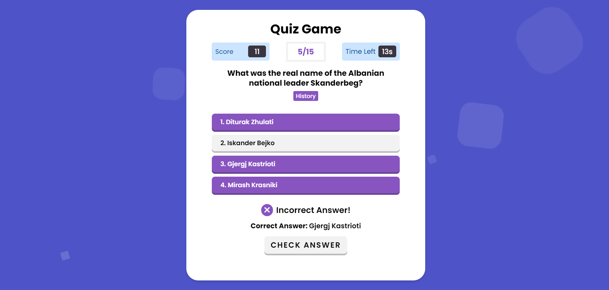

## Quiz Game



Welcome to the Quiz Game! This interactive quiz application is designed to test your knowledge on various topics. Whether you're looking to challenge yourself or compete with friends, this quiz game provides an engaging and fun way to learn new facts.

## Features
- **Multiple Categories:** Choose from a wide range of categories, including general knowledge, science, history, geography, and more.

- **Randomized Questions:** Each quiz session presents questions in a random order, keeping the experience fresh and unpredictable.

- **Score Tracking:** Keep track of your scores and see how well you performed in each category. Challenge yourself to improve and beat your own high scores.

- **User-Friendly Interface:** The game is designed with a simple and intuitive interface, making it easy for users of all ages to enjoy.

## Getting Started
- Clone the Repository:
```
git clone https://github.com/mohanrajmdev/Quiz-Game.git

cd Quiz-Game
```

## Install Dependencies:
- click the index.html to open in the browser.

## Usage
### Choose a Category:
Select a category from the available options.

- **Start the Quiz:**
    - Click on the "Start Quiz" button to begin the quiz session.

- **Answer Questions:** 
    - Answer each question to the best of your knowledge. Click on the correct option or input your answer.

- **View Results:**
    - After completing the quiz, you will see your score and the correct answers. Share your results with friends and challenge them to beat your score.
